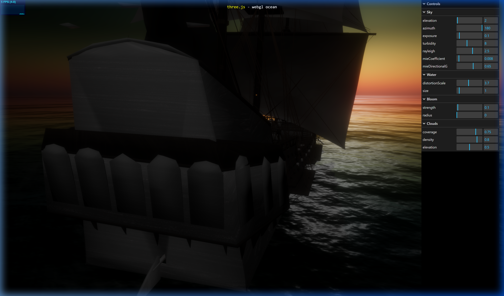

# Ocean Love 🌊🚢🐦

Dự án đồ họa 3D tương tác đại dương premium được xây dựng trên nền tảng **Three.js** và các shader tùy biến nâng cao.

## Các tính năng chính:

1. **Tích hợp Tàu Cướp Biển Black Pearl**:
   - Sử dụng mô hình 3D chi tiết (OBJ/MTL).
   - Cơ chế vật lý dập dềnh, nghiêng lắc tự nhiên theo nhịp sóng biển.
   - Hệ thống đèn bão lồng đèn phát sáng nhấp nháy động trên boong và cabin tàu.
   
2. **Đàn Hải Âu 3D Động**:
   - Tải mô hình 3D `.glb` hải âu thực tế.
   - Thuật toán bầy đàn **Boids Simulation** điều khiển đàn chim bay lượn quanh tàu.
   - Animation vỗ cánh vệt pha ngẫu nhiên giúp chuyển động tự nhiên hơn.
   - Tương tác thông minh: Rê chuột (hover) vào hải âu để highlight phát sáng màu vàng và click chuột để camera bám theo hành trình bay của chú chim đó.

3. **Bầu Trời Mây & Tán Xạ Ánh Sáng Premium**:
   - Bầu trời được phủ thêm nhiều lớp mây động đẹp mắt.
   - Tùy chỉnh các thông số tán xạ khí quyển vật lý (Turbidity, Rayleigh, Mie) mang lại ánh sáng phân bổ đều, dễ chịu, không bị quá tương phản hay tối sầm ở vùng ngược mặt trời.
   - Bộ công cụ kéo thả GUI trực quan cho phép căn chỉnh trực tiếp tất cả thông số biển, mây, sáng trên trình duyệt.

---

## Demo Hình ảnh & Video:

### 1. Phối cảnh đại dương với tàu Black Pearl và đàn hải âu bay lượn:


### 2. Video hoạt cảnh chuyển động thực tế (Vỗ cánh bay lượn và dập dềnh trên sóng):


---

## Hướng dẫn chạy cục bộ (Local Development)

Yêu cầu đã cài đặt [Node.js](https://nodejs.org/).

1. Di chuyển vào thư mục dự án Three.js:
   ```bash
   cd three.js
   ```
2. Cài đặt các thư viện cần thiết:
   ```bash
   npm install
   ```
3. Khởi chạy server phát triển cục bộ:
   ```bash
   npm run dev
   ```
4. Truy cập địa chỉ hiển thị trên terminal (mặc định là `http://localhost:8080/examples/webgl_shaders_ocean.html`).
