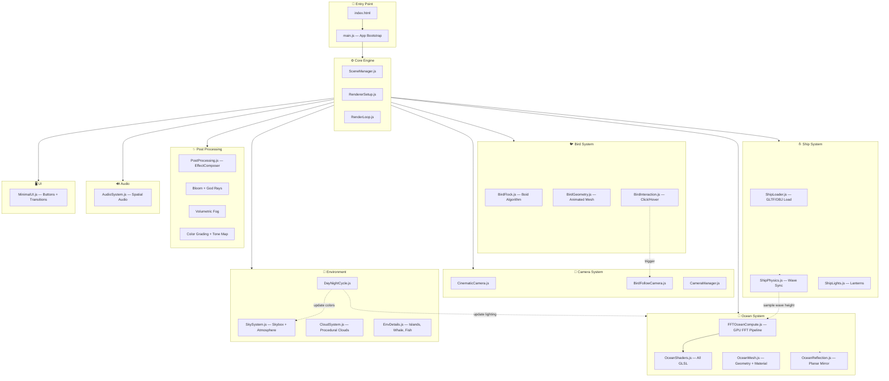

# 🌊 Ocean Love — Implementation Plan

> **"Hai người đang ở trong một giấc mơ giữa đại dương vô tận"**

---

## I. Phân tích mã nguồn FFT Ocean (đã hoàn thành)

### Cấu trúc repo `fft-ocean-ref/`

| File | Vai trò | Tái sử dụng |
|------|---------|-------------|
| [FFTOceanShader.js](file:///d:/App/Code/Du_an/Web/Ocean Love/fft-ocean-ref/js/shaders/FFTOceanShader.js) | 7 GLSL shaders cho FFT simulation (Tessendorf waves) | ✅ Core — port sang ES module |
| [Ocean.js](file:///d:/App/Code/Du_an/Web/Ocean Love/fft-ocean-ref/js/effects/Ocean.js) | FFT pipeline: spectrum → phase → FFT → displacement → normals → render | ✅ Core — refactor cho Three.js mới |
| [OceanShader.js](file:///d:/App/Code/Du_an/Web/Ocean Love/fft-ocean-ref/js/shaders/OceanShader.js) | Vertex displacement + fragment (fresnel, specular, reflection) | ✅ Enhance — thêm foam, subsurface |
| [MirrorRenderer.js](file:///d:/App/Code/Du_an/Web/Ocean Love/fft-ocean-ref/js/effects/MirrorRenderer.js) | Planar reflection cho ocean surface | ✅ Port — cập nhật API |
| [CloudShader2.js](file:///d:/App/Code/Du_an/Web/Ocean Love/fft-ocean-ref/js/shaders/CloudShader2.js) | Procedural cloud dome với fractal noise | ✅ Enhance — thêm volumetric feel |
| [ScreenSpaceShader.js](file:///d:/App/Code/Du_an/Web/Ocean Love/fft-ocean-ref/js/shaders/ScreenSpaceShader.js) | Screen-space projection cho ocean plane | ✅ Port |
| [demo.js](file:///d:/App/Code/Du_an/Web/Ocean Love/fft-ocean-ref/js/demo.js) | Main app: scene, ship, camera, controls, environment | 🔄 Reference — viết lại hoàn toàn |
| `models/BlackPearl/` | OBJ ship model + textures (sails, wood, flag) | ✅ Dùng trực tiếp (convert OBJ→GLB nếu cần) |
| `sound/waves.mp3, rain.mp3` | Ambient audio files | ✅ Dùng + bổ sung thêm |

### Vấn đề cần giải quyết khi port

> [!WARNING]
> Repo gốc dùng **Three.js r71** (rất cũ). Cần port sang **Three.js r160+**:
> - `THREE.ShaderLib` custom entries → ES module exports
> - `renderer.context` → `renderer.getContext()`
> - `THREE.WebGLRenderTarget` API thay đổi
> - `THREE.Geometry` → `THREE.BufferGeometry`
> - `THREE.OBJMTLLoader` → `OBJLoader` + `MTLLoader` riêng
> - `MirrorRenderer` → port hoặc dùng `THREE.Reflector`

---

## II. Architecture Overview



---

## III. Technology Stack

| Layer | Công nghệ | Phiên bản |
|-------|-----------|-----------|
| Runtime | Vite (dev server + bundler) | Latest |
| 3D Engine | Three.js | r160+ |
| Shaders | GLSL (inline + separate files) | WebGL 2.0 |
| Post FX | three/examples/jsm/postprocessing | Built-in |
| Animation | GSAP | 3.x |
| Audio | Web Audio API + Howler.js | — |
| Font | Google Fonts (Cormorant Garamond) | — |
| Package | npm | — |

---

## IV. Cấu trúc thư mục

```
Ocean Love/
├── fft-ocean-ref/              # Reference repo (giữ nguyên)
├── index.html                  # Entry point
├── package.json
├── vite.config.js
├── public/
│   ├── models/
│   │   └── ship/               # BlackPearl GLB (converted)
│   ├── textures/
│   │   ├── skybox/             # 6-face cubemap textures
│   │   ├── foam.png            # Ocean foam texture
│   │   └── mountains.png       # Distant mountains
│   ├── audio/
│   │   ├── waves.mp3
│   │   ├── wind.mp3
│   │   ├── seagull.mp3
│   │   └── sail-creak.mp3
│   └── fonts/
├── src/
│   ├── main.js                 # App entry
│   ├── config.js               # Global constants
│   │
│   ├── core/
│   │   ├── SceneManager.js
│   │   ├── RendererSetup.js
│   │   └── RenderLoop.js
│   │
│   ├── ocean/
│   │   ├── FFTOceanCompute.js  # GPU FFT pipeline (ported)
│   │   ├── OceanShaders.js     # All GLSL shaders
│   │   ├── OceanMesh.js        # Geometry + enhanced material
│   │   ├── OceanReflection.js  # Mirror/reflector
│   │   └── OceanFoam.js        # Foam overlay shader
│   │
│   ├── ship/
│   │   ├── ShipLoader.js       # Load + setup model
│   │   ├── ShipPhysics.js      # Wave height sync
│   │   └── ShipLights.js       # Lantern point lights
│   │
│   ├── camera/
│   │   ├── CinematicCamera.js  # Default dreamy camera
│   │   ├── BirdFollowCamera.js # Follow seagull camera
│   │   └── CameraManager.js    # Switch + blend cameras
│   │
│   ├── birds/
│   │   ├── BirdFlock.js        # Boid flocking algorithm
│   │   ├── BirdGeometry.js     # Animated wing mesh
│   │   └── BirdInteraction.js  # Raycasting + click
│   │
│   ├── environment/
│   │   ├── SkySystem.js        # Skybox + gradient
│   │   ├── CloudSystem.js      # Procedural clouds
│   │   ├── DayNightCycle.js    # Time-of-day manager
│   │   ├── AtmosphericFog.js   # Fog + haze
│   │   └── EnvDetails.js       # Islands, whale, particles
│   │
│   ├── postprocessing/
│   │   └── PostProcessing.js   # EffectComposer setup
│   │
│   ├── audio/
│   │   └── AudioSystem.js      # Spatial ambient audio
│   │
│   ├── ui/
│   │   └── MinimalUI.js        # Overlay UI
│   │
│   └── shaders/                # Raw GLSL files
│       ├── ocean_sim.vert
│       ├── ocean_subtransform.frag
│       ├── ocean_initial_spectrum.frag
│       ├── ocean_phase.frag
│       ├── ocean_spectrum.frag
│       ├── ocean_normals.frag
│       ├── ocean_surface.vert
│       ├── ocean_surface.frag
│       ├── cloud.vert
│       ├── cloud.frag
│       ├── atmosphere.frag
│       └── godrays.frag
│
├── styles/
│   └── index.css
└── README.md
```

---

## V. 8 Phases Chi Tiết

### Phase 1: Project Setup + Core Engine
**Thời gian ước tính: ~30 phút**

**Tasks:**
1. Khởi tạo Vite project (`npx -y create-vite@latest ./`)
2. Cài dependencies: `three`, `gsap`, `howler`
3. Tạo `index.html` với meta tags, font links, minimal CSS
4. Tạo `src/core/RendererSetup.js`:
   - WebGLRenderer với `antialias`, `alpha`, `logarithmicDepthBuffer`
   - Enable extensions: `OES_texture_float`, `OES_texture_float_linear`
   - `toneMapping: THREE.ACESFilmicToneMapping`
   - `outputColorSpace: THREE.SRGBColorSpace`
5. Tạo `src/core/SceneManager.js`:
   - Scene, PerspectiveCamera (FOV 55, near 0.5, far 1000000)
   - DirectionalLight + AmbientLight
   - Fog setup
6. Tạo `src/core/RenderLoop.js`:
   - RAF loop với delta time tracking
   - Performance stats (optional)
7. Tạo `src/main.js` — bootstrap tất cả modules

**Output:** Một scene trống với background gradient, render loop chạy ổn định.

---

### Phase 2: FFT Ocean System (CORE)
**Thời gian ước tính: ~2 giờ**

> [!IMPORTANT]
> Đây là phần phức tạp nhất và quan trọng nhất. Port toàn bộ FFT pipeline từ repo gốc sang Three.js hiện đại.

**Tasks:**
1. **Port `FFTOceanShader.js` → `src/shaders/*.glsl` + `src/ocean/OceanShaders.js`**
   - Tách 7 shader programs thành separate GLSL files
   - Import via Vite raw loader (`?raw`)
   - Cập nhật uniform declarations cho Three.js mới

2. **Port `ScreenSpaceShader.js` → `src/ocean/OceanMesh.js`**
   - Screen-space projected ocean plane
   - Sử dụng `PlaneBufferGeometry` resolution 256x256

3. **Port `Ocean.js` → `src/ocean/FFTOceanCompute.js`**
   - Framebuffer pipeline: `initialSpectrum → phase → spectrum → FFT(H+V) → displacement → normals`
   - Cập nhật `WebGLRenderTarget` API:
     ```js
     // Old: renderer.render(scene, cam, target, clear)
     // New: renderer.setRenderTarget(target); renderer.render(scene, cam);
     ```
   - Float texture support check

4. **Port `MirrorRenderer.js` → `src/ocean/OceanReflection.js`**
   - Hoặc thay bằng `THREE.Reflector` nếu compatible
   - Planar reflection matrix computation

5. **Enhance ocean surface shader (`ocean_surface.frag`)**:
   - **Fresnel effect**: `pow(1.0 - dot(normal, viewDir), 2.0)` — đã có
   - **Subsurface scattering**: thêm green-blue transmission
   - **Foam**: white highlights ở wave peaks dựa trên displacement jacobian
   - **Atmospheric blending**: fade to fog color ở horizon
   - **Color grading**: warm/cool ocean colors theo time-of-day

6. **Wave parameters cho "gentle cinematic"**:
   ```
   INITIAL_SIZE: 200.0        // wave scale
   INITIAL_WIND: [4.0, 4.0]   // gentle wind (giảm từ 10)
   INITIAL_CHOPPINESS: 1.5     // moderate choppiness (giảm từ 3.6)
   GEOMETRY_RESOLUTION: 256
   GEOMETRY_SIZE: 512
   RESOLUTION: 512             // FFT resolution
   ```

**Output:** Ocean chạy FFT realtime, sóng gentle, có reflection, fresnel, foam nhẹ.

---

### Phase 3: Ship System
**Thời gian ước tính: ~1 giờ**

**Tasks:**
1. **`src/ship/ShipLoader.js`**
   - Load BlackPearl model (OBJ+MTL hoặc convert sang GLB)
   - Sử dụng `OBJLoader` + `MTLLoader` từ three/examples
   - Set `material.side = DoubleSide` cho tất cả children
   - Scale + position phù hợp

2. **`src/ship/ShipPhysics.js`** — Wave synchronization
   - Sample wave height từ FFT displacement map tại vị trí ship:
     ```js
     // Đọc displacement texture tại UV tương ứng ship position
     // ship.position.y = baseY + sampledDisplacement.y * scale
     ```
   - Tính wave slope → ship rotation (pitch + roll):
     ```js
     // Sample 4 điểm xung quanh ship → tính gradient
     // ship.rotation.x = atan2(dH/dz) * smoothFactor
     // ship.rotation.z = atan2(dH/dx) * smoothFactor
     ```
   - Smooth interpolation với `lerp(current, target, 0.02)`
   - Thêm gentle yaw oscillation: `cos(time * 0.0008) * 0.05`

3. **`src/ship/ShipLights.js`**
   - 4-6 `THREE.PointLight` (color: `#ffaa44`, intensity: 0.8, distance: 50)
   - Đặt ở: mast, cabin, bow, stern
   - Subtle flicker animation: `intensity = base + sin(time * random) * 0.1`
   - Emissive material cho lantern meshes

**Output:** Ship floating tự nhiên theo sóng, có đèn lantern vàng ấm.

---

### Phase 4: Sky + Environment
**Thời gian ước tính: ~1.5 giờ**

**Tasks:**
1. **`src/environment/SkySystem.js`**
   - CubeMap skybox (sử dụng textures từ repo gốc)
   - Hoặc procedural sky shader (gradient + sun disc)
   - Skybox mesh: `BoxGeometry(450000)` BackSide

2. **`src/environment/CloudSystem.js`**
   - Port `CloudShader2.js` → ES module
   - Procedural fractal noise clouds trên dome geometry
   - Parameters: `cover: 0.5`, `sharp: 0.9`, slow movement
   - `ParametricGeometry` sky dome

3. **`src/environment/AtmosphericFog.js`**
   - `THREE.FogExp2` cho scene (density: 0.00008)
   - Custom fog shader cho ocean horizon blending
   - Atmospheric perspective: distant objects → fog color

4. **`src/environment/EnvDetails.js`**
   - **Distant mountains**: Cylinder geometry + texture (từ repo)
   - **Small islands**: Simple geometry silhouettes, rất xa
   - **Whale jump**: Animated mesh, trigger ngẫu nhiên mỗi 30-60s, xa xa
   - **Glowing particles**: `THREE.Points` dưới nước (bioluminescence)
   - **Shooting stars** (night mode): line geometry + fade animation

5. **`src/environment/DayNightCycle.js`**
   - 3 modes: `sunset`, `night`, `dawn` (default: sunset)
   - State machine với slow GSAP transitions (duration: 8-12s):

   | Parameter | Sunset | Night | Dawn |
   |-----------|--------|-------|------|
   | Sun position | (-0.7, 0.2, -1) | (-0.3, -0.5, 1) | (0.8, 0.1, 0.5) |
   | Sun color | #ffcc88 | #4466aa | #ffaa66 |
   | Sky tint | warm orange | deep blue | soft pink |
   | Ocean color | (0.35, 0.4, 0.45) | (0.05, 0.08, 0.15) | (0.3, 0.35, 0.5) |
   | Fog color | #ff8844 | #0a1628 | #ffccaa |
   | Exposure | 0.15 | 0.08 | 0.12 |
   | Stars visible | ❌ | ✅ | ❌ |
   | Moon visible | ❌ | ✅ | ❌ |

**Output:** Beautiful sky, clouds, fog, distant environment details, day/night switching.

---

### Phase 5: Camera System
**Thời gian ước tính: ~1 giờ**

**Tasks:**
1. **`src/camera/CinematicCamera.js`** — Default camera
   - Orbit quanh ship với heavy inertia (damping: 0.02)
   - Auto-rotate chậm khi idle (speed: 0.05 deg/s)
   - **Camera sway**: subtle breathing + wave sync
     ```js
     camera.position.y += sin(time * 0.5) * 0.3;  // breathing
     camera.position.x += sin(time * 0.3) * 0.2;  // sway
     camera.rotation.z = sin(time * 0.7) * 0.003;  // tilt
     ```
   - Mouse drag → smooth orbit (NOT game-like snap)
   - Scroll → dolly with smooth ease
   - Min distance: 200, Max distance: 2000
   - Polar angle clamp: [15°, 75°] — không cho nhìn xuống nước quá sát

2. **`src/camera/BirdFollowCamera.js`** — Bird chase camera
   - Khi click chim → camera smooth transition sang follow mode
   - Camera chạy theo spline path phía sau chim
   - Slight lag + overshoot cho cinematic feel
   - FOV animates wider (55 → 65) khi following
   - Auto-return về cinematic mode sau 10s hoặc click lại

3. **`src/camera/CameraManager.js`**
   - Quản lý switch giữa các camera modes
   - Smooth blend transition (GSAP `timeline`)
   - Priority system: user interaction > auto-sequence

**Output:** Dreamy cinematic camera, smooth as butter.

---

### Phase 6: Bird Flocking System
**Thời gian ước tính: ~1.5 giờ**

**Tasks:**
1. **`src/birds/BirdGeometry.js`** — Animated seagull mesh
   - Procedural bird geometry (body + 2 wings)
   - Wing flap animation via vertex shader:
     ```glsl
     // Wing vertices oscillate up/down based on time + wing position
     float wingAngle = sin(u_time * wingSpeed + wingPhase) * maxAngle;
     position.y += wingAngle * abs(position.x) / wingSpan;
     ```
   - White body, slight gray wing tips
   - ~50-100 vertices per bird (lightweight)

2. **`src/birds/BirdFlock.js`** — Boid flocking algorithm
   - 15-25 birds total
   - 3 classic boid rules:
     - **Separation**: avoid crowding (radius: 20)
     - **Alignment**: steer toward average heading (radius: 50)
     - **Cohesion**: move toward center of mass (radius: 80)
   - Additional rules:
     - **Ship attraction**: gentle pull toward ship area
     - **Height variation**: random altitude changes
     - **Speed variation**: 5-15 units/s
   - Smooth spline interpolation between waypoints
   - `THREE.InstancedMesh` cho performance

3. **`src/birds/BirdInteraction.js`** — User interaction
   - Raycaster trên bird bounding spheres
   - **Hover**: bird highlights subtly (slight glow)
   - **Click**:
     1. Clicked bird breaks from flock
     2. Flies in dramatic arc direction
     3. Camera transitions to follow (via CameraManager)
     4. Other birds scatter slightly then regroup
   - Cursor changes to pointer on hover

**Output:** 15-25 seagulls flocking naturally, clickable, camera follows.

---

### Phase 7: Post Processing + Audio
**Thời gian ước tính: ~1 giờ**

**Tasks:**
1. **`src/postprocessing/PostProcessing.js`**
   - `EffectComposer` pipeline:
     ```
     RenderPass → UnrealBloomPass → Custom GodRaysPass → Custom FogPass → OutputPass
     ```
   - **Bloom**: strength 0.3, radius 0.5, threshold 0.85
   - **God rays**: from sun position, subtle
   - **DOF**: subtle, focus on ship
   - **Color grading**: via `ShaderPass` với LUT hoặc manual curves
   - **Vignette**: subtle edge darkening
   - **Film grain**: very subtle (opacity 0.03)

2. **`src/audio/AudioSystem.js`**
   - Sử dụng Howler.js cho reliable cross-browser audio
   - Ambient layers (all loop, crossfade):

   | Sound | Volume | Spatial | Note |
   |-------|--------|---------|------|
   | Ocean waves | 0.4 | ❌ | Continuous, primary |
   | Wind | 0.2 | ❌ | Subtle, variable |
   | Sail creaking | 0.15 | ✅ (ship) | Intermittent |
   | Seagull calls | 0.1 | ✅ (birds) | Random triggers |

   - Volume adjusts with camera distance to ship
   - Mute button (minimal UI)
   - Auto-play with user interaction gate (browser policy)

**Output:** Cinematic post-processing + immersive audio.

---

### Phase 8: UI + Polish + Optimization
**Thời gian ước tính: ~1 giờ**

**Tasks:**
1. **`src/ui/MinimalUI.js`**
   - **Loading screen**: ocean-themed, progress bar, fade out
   - **Time-of-day buttons**: 3 subtle icons (sunset/night/dawn), bottom-right
   - **Audio toggle**: volume icon, bottom-left
   - **Fullscreen button**: top-right
   - **Hint text**: "Click a seagull to fly" — fade after 5s
   - Font: `Cormorant Garamond` (elegant serif)
   - All UI elements: `opacity: 0.6`, `transition: 0.3s`

2. **Styles (`styles/index.css`)**
   - Dark background fallback
   - No scrollbars, no selection
   - Canvas 100vw × 100vh
   - Minimal UI positioning + animations

3. **Performance optimization**
   - FFT resolution: 256 on mobile, 512 on desktop (detect via `navigator.hardwareConcurrency`)
   - Ship LOD: simplified mesh at distance
   - Birds: `InstancedMesh` (1 draw call for all birds)
   - Frustum culling: auto (Three.js default)
   - Texture compression: use `.webp` where possible
   - Render target sizes: half-res for reflection
   - `requestAnimationFrame` with delta time capping (max 60fps target)
   - Dispose textures/geometry on cleanup

4. **Final polish**
   - Smooth initial camera flyover on load
   - Particle dust/mist near water surface
   - Subtle lens flare from sun
   - "Love message" easter egg: click ship cabin → text appears on sail

---

## VI. Dependency Graph (Build Order)

```mermaid
gantt
    title Ocean Love — Build Order
    dateFormat X
    axisFormat %s

    section Phase 1
    Vite + Three.js Setup        :p1a, 0, 5
    Core Engine (Scene/Renderer)  :p1b, 5, 15
    Render Loop                   :p1c, 15, 20

    section Phase 2
    Port FFT Shaders             :p2a, 20, 40
    Port Ocean.js Pipeline       :p2b, 40, 70
    Port Mirror/Reflection       :p2c, 70, 85
    Enhance Ocean Surface        :p2d, 85, 100

    section Phase 3
    Ship Loader                  :p3a, 100, 115
    Ship Wave Physics            :p3b, 115, 135
    Ship Lantern Lights          :p3c, 135, 145

    section Phase 4
    Skybox + Atmosphere          :p4a, 145, 160
    Cloud System                 :p4b, 160, 175
    Day/Night Cycle              :p4c, 175, 195
    Env Details                  :p4d, 195, 215

    section Phase 5
    Cinematic Camera             :p5a, 215, 235
    Bird Follow Camera           :p5b, 235, 250
    Camera Manager               :p5c, 250, 260

    section Phase 6
    Bird Geometry                :p6a, 260, 275
    Boid Flocking                :p6b, 275, 300
    Bird Interaction             :p6c, 300, 315

    section Phase 7
    Post Processing              :p7a, 315, 340
    Audio System                 :p7b, 340, 355

    section Phase 8
    Minimal UI                   :p8a, 355, 370
    Polish + Optimization        :p8b, 370, 390
```



---

## VII. Rủi ro & Giải pháp

| Rủi ro | Mức độ | Giải pháp |
|--------|--------|-----------|
| FFT shader không tương thích Three.js mới | 🔴 Cao | Đã đọc kỹ source, chuẩn bị mapping API changes |
| OBJ ship model quá nặng (3MB) | 🟡 Trung bình | Convert sang GLB + draco compression (~300KB) |
| Float texture không support trên mobile | 🟡 Trung bình | Fallback: half-float hoặc simplified wave |
| Audio autoplay bị browser block | 🟢 Thấp | User click gate trên loading screen |
| Performance trên laptop tầm trung | 🟡 Trung bình | Adaptive quality: giảm FFT res, bird count, bloom |

---

## VIII. Asset Cần Bổ Sung

| Asset | Nguồn | Ghi chú |
|-------|-------|---------|
| Skybox sunset textures | Có trong repo gốc (`img/sunset_*`) | ✅ Sẵn có |
| Skybox night textures | Có trong repo gốc (`img/grimmnight_*`) | ✅ Sẵn có |
| Ship model | Có trong repo (`models/BlackPearl/`) | ✅ Sẵn có |
| Ocean wave audio | Có trong repo (`sound/waves.mp3`) | ✅ Sẵn có |
| Wind audio | Cần tìm/tạo | 🔄 Dùng free sound hoặc tự gen |
| Seagull call audio | Cần tìm/tạo | 🔄 Dùng free sound |
| Foam texture | Procedural hoặc simple noise | 🔄 Generate trong code |
| Mountain silhouette | Có trong repo (`img/mountains.png`) | ✅ Sẵn có |

---

## IX. Tóm tắt

> [!NOTE]
> **Tổng cộng ~9.5 giờ dev** cho full production-ready experience.
> 
> Chiến lược: Port FFT ocean core trước (Phase 2) vì đây là nền tảng. Sau đó build ship + environment lên trên. Camera + birds là layer interaction. Post-processing + audio là polish cuối.

**Ưu tiên #1**: Ocean phải đẹp, cinematic, không fake.
**Ưu tiên #2**: Ship floating tự nhiên, synchronized.
**Ưu tiên #3**: Atmosphere + mood — đây là emotional experience.

---

**Sẵn sàng. Nói "làm" là bắt đầu Phase 1.** 🚀
